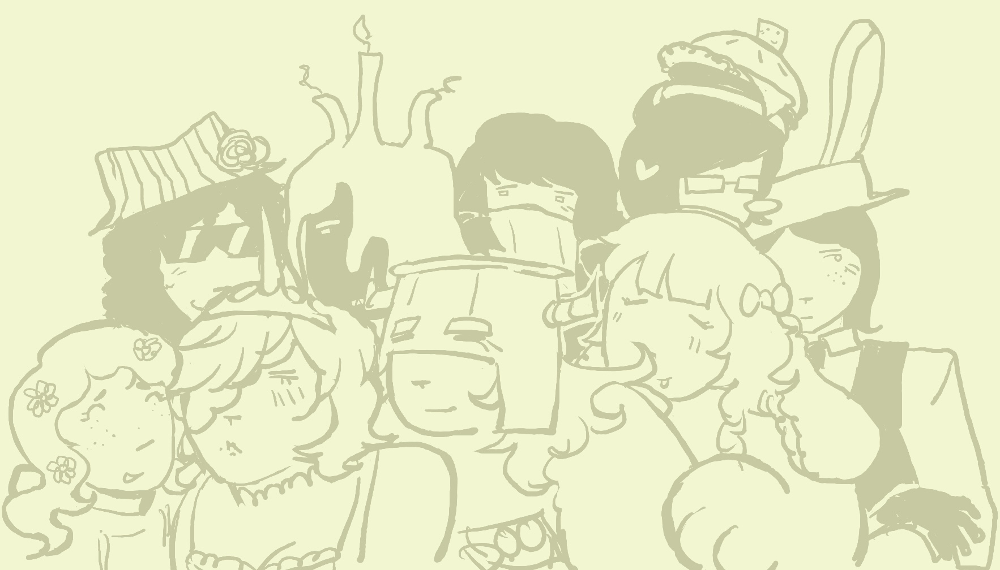
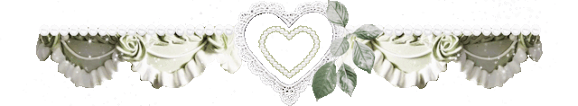
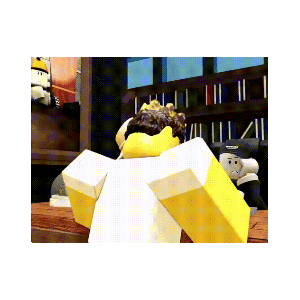
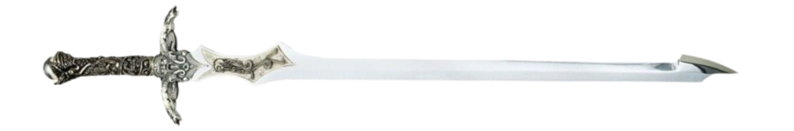
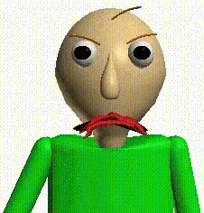
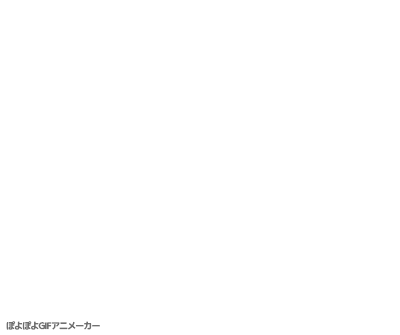

  

  

<h1 align="center">  ρᥲvᥱmᥱᥒt  </h1>

 ‎  

ʜᴇ/ɪᴛ; ᴇɴɢ/ɢᴇʀ; ᴀʀᴛɪꜱᴛ+ᴠᴏɪᴄᴇ ᴀᴄᴛᴏʀ

  

ᴅɴɪ ɪꜰ ᴜʀ ᴘᴏᴏ

<h1 align="center">  ‎   </h1>

  

  

    
<h1>ιᥒtᥱrᥱsts</h1>

     
    
ʀᴏʙʟᴏx; ᴅᴏᴏᴍᴛʀᴀᴘᴘᴇᴅ; ʀᴇꜱɪᴅᴇɴᴛ ᴇᴠɪʟ ꜱᴇʀɪᴇꜱ; ᴍᴇᴛᴀʟ ɢᴇᴀʀ ꜱᴏʟɪᴅ ꜱᴇʀɪᴇꜱ; ꜰᴇᴀʀ ᴀɴᴅ ʜᴜɴɢᴇʀ 1+2; ꜱɪʟᴇɴᴛ ʜɪʟʟ; ꜱɪɢɴᴀʟɪꜱ; ꜰᴀʟʟᴏᴜᴛ: ɴᴇᴡ ᴠᴇɢᴀꜱ 

        
ɢᴇᴛ ᴛᴏ ᴋɴᴏᴡ ᴍᴇ ꜰᴏʀ ᴍᴏʀᴇ!!!

    
  

  

    
<h1>dᥒι</h1>

     
    
ᴘʀᴏꜱʜɪᴘᴘᴇʀꜱ; ʀᴀᴄɪꜱᴛꜱ.. ɪ ʙʟᴏᴄᴋ ꜰʀᴇᴇʟʏ, ᴊᴜꜱᴛ ʙᴇ ᴋɪɴᴅ!

  

  

[ᶜᵒᵈᵉᵈ ᵇʸ ᵏⁱᵗ](https://github.com/kits-kats)

<!--
**GOD2RETRIBUTION/GOD2RETRIBUTION** is a ✨ _special_ ✨ repository because its `README.md` (this file) appears on your GitHub profile.

Here are some ideas to get you started:

- 🔭 I’m currently working on ...
- 🌱 I’m currently learning ...
- 👯 I’m looking to collaborate on ...
- 🤔 I’m looking for help with ...
- 💬 Ask me about ...
- 📫 How to reach me: ...
- 😄 Pronouns: ...
- ⚡ Fun fact: ...
-->
